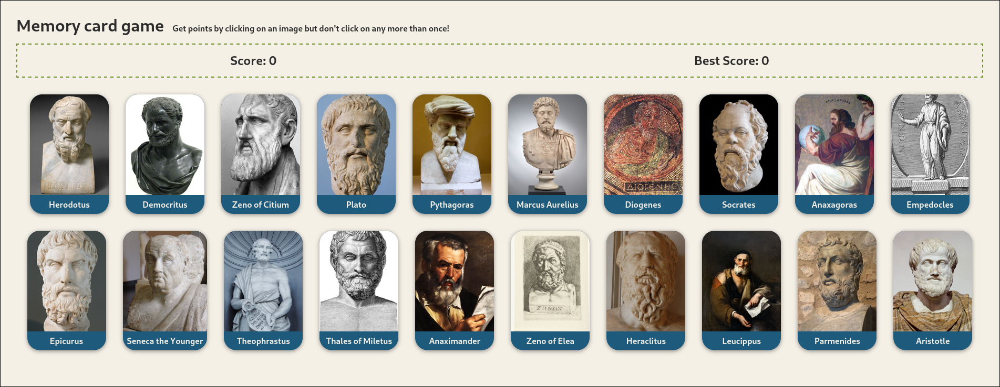

# Memory card
A memory game built in React. This project is part of the React section of [The Odin Project curriculum](https://www.theodinproject.com). I’ve added my own touch by using TypeScript instead of JavaScript.  
See the [original assignment](https://www.theodinproject.com/lessons/node-path-react-new-memory-card).

Visit the [live demo](https://memory-cards-game-fran-dv.netlify.app/)

## About
This project is an assignment from The Odin Project’s React section in the full-stack curriculum. It’s a memory game with cards featuring characters (in my case, ancient thinkers): you score a point by selecting a thinker, but you lose your score if you select the same thinker twice.

The data for the thinkers (image and name) is provided by an API, as required by the assignment. In this case, I’ve used the [MediaWiki API](https://www.mediawiki.org/wiki/API:Main_page). The purpose of this requirement is to practice using the `useEffect` hook.

## Technologies 
- React
- Typescript
- CSS modules
- Vite
- ESLint & Prettier
- Bun (package manager)

